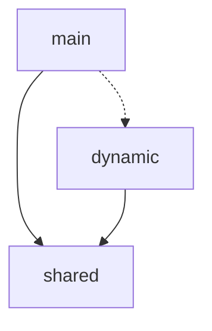
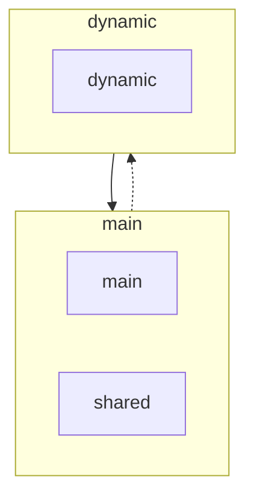

# NgxBuild

Tools to optimize build outputs from Angular when using Esbuild.

https://repl.rolldown.rs/#eNqNUsFugzAM/RUrF1qpgjsVu2y7Taq0TdqllwhMly01KDEdFeLf57SEtds0DRDBid97xn6DqlU+KCR2x/TNh29S+Ve8UqWEZt82jmHoR6hds4ckzSrNWhKSLZUN+cZiapvdol9uaUvn9EXIOpLemzIkLtdChipn1+G4Uq6xtmo+KBV4bXYpz9q/nFxVwccWYYDHKW3TspEKIJYW4ck6lIL9CVNhrTvLsBhAtwbGZf4DX9zAEBAADrlzFCKQy1DbcQ5JbEmyOu+3Dj26A96H/SezIy0o9DnU2nqckkQendkLVts8MgJ4dqbk+x7LLohvXIUuh9CZCTdOa9PxSX1GZpmuDppKrG5fO3oXufkoHBoqbVfhHbZIFVJp0D+KiPPmgPZ4JRHSo8wYFnnJs6Usg2fTCrN0KjVC00f+oihAf2jDECc8N1vmLrjzFXCXP/4HLrvMCyRKrDFZK/ohhmcTTAMNpmPooYDkZfMgdxj3tRPXJ67ZgDPd184/zP2dVI1CehCU1Yye1fgJOTMWYg==

https://esbuild.github.io/try/#YgAwLjI1LjExAHsKICBidW5kbGU6IHRydWUsCiAgZm9ybWF0OiAnZXNtJywKICBzcGxpdHRpbmc6IHRydWUsCiAgb3V0ZGlyOiAnLycsCn0AZQBlbnRyeS5qcwBpbXBvcnQge3h9IGZyb20gJy4vZGF0YS5qcycKY29uc29sZS5sb2coeCkKCmltcG9ydCgnLi9keW5hbWljLmpzJykAAGR5bmFtaWMuanMAaW1wb3J0IHt4fSBmcm9tICcuL2RhdGEuanMnCgpjb25zb2xlLmxvZyh4KQAAZGF0YS5qcwBleHBvcnQgY29uc3QgeCA9ICdXT0xPTE8nOw

### Reachability strategy

The reachability strategy attempts to optimize the bundle as much as possible without any significant increase in bundle size. 

It does this by traversing the imports and merging chunks based on the paths from which the code is reachable.

#### Motivation

The Esbuild chunking algorithm considers each dynamic entry point, as its own entry point. Because it does not 
distinguish between entry points, it will optimize each entry point to reduce the amount of code required to load that
entry point.


TODO add visual

However, in the context of single page applications like angular, there is only one entry point and the rest of the 
dynamic entry points cannot load or function outside that context. This means that we do not need to optimize for each
entry point but instead optimize for the entry points considering only there reachability from the main entry point.

TODO add visual



#### Rolldown considerations

This is achievable with rolldown and would usually be the default behaviour. However, there are a couple caviates and
configurations that would have to be used. 

TODO explain the config and why its necessary

Yet, this still does not work when rebundling an angular application, because of that we require analyzing the module
graph ourselves and create an advance chunking strategy based on this strategy.


## Usage

> [!IMPORTANT]
> This is still not published, we hope that we don't need to and angular will integrate something into the new build 
> system. This is already in progress with the experimental chunk optimizer:
> [`NG_BUILD_OPTIMIZE_CHUNKS=1`](https://github.com/angular/angular-cli/pull/27953)

It is currently exposed as an Esbuild Plugin allowing you to simply add it to you build target in NX and optionally
specify the number of chunks you would like to output:

```json
{
  "build": {
    "executor": "@nx/angular:application",
    "options": {
      "plugins": ["@ngx-build/esbuild-plugin"]
    }
  }
}
```

By default, we optimize produce 6 initial chunks as use a greedy algorithm to make them approximately the same size. 
However, if you want to specify the number of chunks you would it to output you can pass it to the plugin:

```json
{
  "build": {
    "executor": "@nx/angular:application",
    "options": {
      "plugins": [
        {
          "path": "@ngx-build/esbuild-plugin",
          "options": {
            "maxChunks": 3
          }
        }
      ]
    }
  }
}
```

## Optimizing Initial Chunks

When migrating to [Angular's new Build System](https://angular.dev/tools/cli/build-system-migration) you might have 
noticed that there is a significant difference in the initial chunks. 

While Webpack originally bundled the initial chunks into a couple of named chunks: 

- main.ts
- runtime.ts
- vendor.ts
- polyfills.ts

Esbuild on the other hand does not work in the same was and will many more initial unnamed chunks: 

- main.ts
- polyfills.ts
- chunk.1.ts
- chunk.2.ts
- chunk.3.ts
- ...

It is important to recognize this is not an issue for most application and is only a problem when you have a very large
and dynamic application. The issue comes when what use to be 3 or 4 files has now become 200 files, all necessary to 
bootstrap the application. This will cause a performance degradation for the initial user experience, which we like to 
refer to as `The Chunk Gap`.

The degradation in performance is most likely caused by `network thrashing` as both the server and client are being
overwhelmed with excessive requests. And even tho HTTP/2 and HTTP/3 have a massive advantage over HTTP 1.1 we can 
still see a clear degradation.

### Additional Information

We are working on extending the docs, in the meantime here are some resources which might be helpful:

- [refactor(@angular/build): add experimental chunk optimizer for production application builds](https://github.com/angular/angular-cli/pull/27953)
- [Creating unnecessary excessive chunks](https://github.com/angular/angular-cli/issues/27715)
- [Code splitting is creating many small unnecessary chunks](https://github.com/evanw/esbuild/issues/3780)
- [Degraded Web Vitals (LCP, FCP) after switching a universal app to esbuild](https://github.com/angular/angular-cli/issues/27321)
- [application builder generates many initial chunks](https://github.com/angular/angular-cli/issues/26307#issuecomment-1830438109)


-- Compare output states of both bundles and identify where the additional sources are coming from. 

-- Investigate potential issues with js transformer

