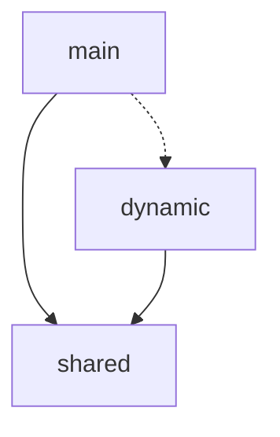
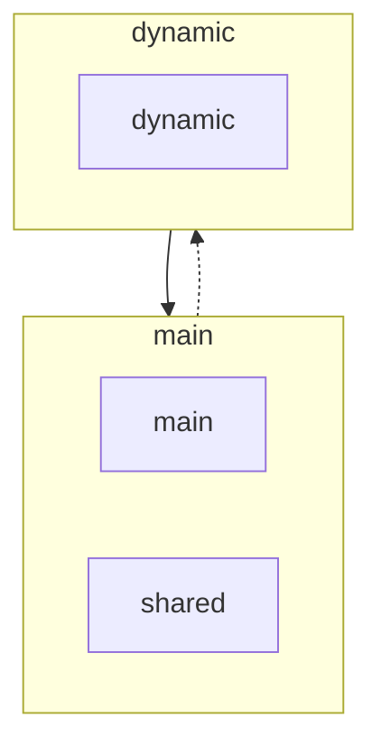
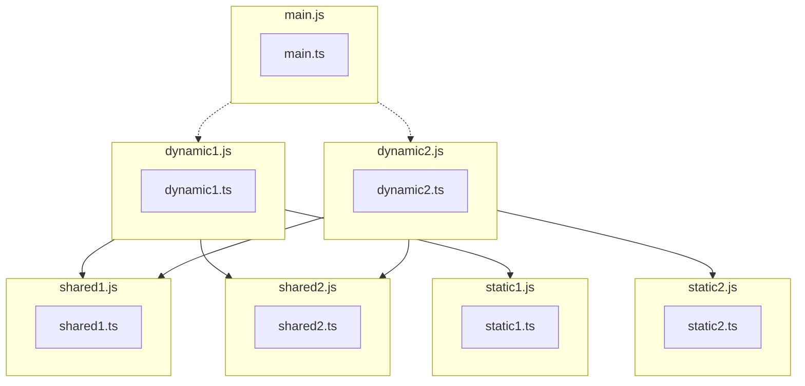
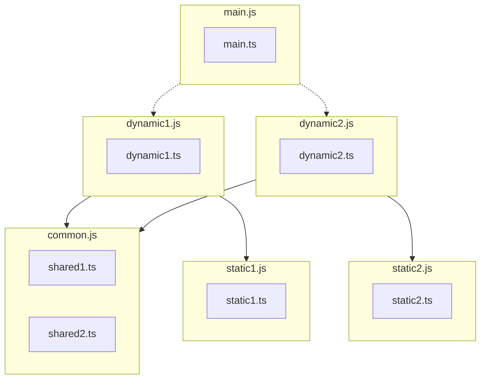

# NgxBuild

Tools to optimize build outputs from Angular when using Esbuild.

https://repl.rolldown.rs/#eNqNUsFugzAM/RUrF1qpgjsVu2y7Taq0TdqllwhMly01KDEdFeLf57SEtds0DRDBid97xn6DqlU+KCR2x/TNh29S+Ve8UqWEZt82jmHoR6hds4ckzSrNWhKSLZUN+cZiapvdol9uaUvn9EXIOpLemzIkLtdChipn1+G4Uq6xtmo+KBV4bXYpz9q/nFxVwccWYYDHKW3TspEKIJYW4ck6lIL9CVNhrTvLsBhAtwbGZf4DX9zAEBAADrlzFCKQy1DbcQ5JbEmyOu+3Dj26A96H/SezIy0o9DnU2nqckkQendkLVts8MgJ4dqbk+x7LLohvXIUuh9CZCTdOa9PxSX1GZpmuDppKrG5fO3oXufkoHBoqbVfhHbZIFVJp0D+KiPPmgPZ4JRHSo8wYFnnJs6Usg2fTCrN0KjVC00f+oihAf2jDECc8N1vmLrjzFXCXP/4HLrvMCyRKrDFZK/ohhmcTTAMNpmPooYDkZfMgdxj3tRPXJ67ZgDPd184/zP2dVI1CehCU1Yye1fgJOTMWYg==

https://esbuild.github.io/try/#YgAwLjI1LjExAHsKICBidW5kbGU6IHRydWUsCiAgZm9ybWF0OiAnZXNtJywKICBzcGxpdHRpbmc6IHRydWUsCiAgb3V0ZGlyOiAnLycsCn0AZQBlbnRyeS5qcwBpbXBvcnQge3h9IGZyb20gJy4vZGF0YS5qcycKY29uc29sZS5sb2coeCkKCmltcG9ydCgnLi9keW5hbWljLmpzJykAAGR5bmFtaWMuanMAaW1wb3J0IHt4fSBmcm9tICcuL2RhdGEuanMnCgpjb25zb2xlLmxvZyh4KQAAZGF0YS5qcwBleHBvcnQgY29uc3QgeCA9ICdXT0xPTE8nOw

### Reachability strategy

The reachability strategy attempts to optimize the bundle as much as possible without any significant increase in bundle size.

It does this by traversing the imports and merging chunks based on the paths from which the code is reachable.

#### Motivation

The Esbuild chunking algorithm considers each dynamic entry point, as its own entry point. Because it does not
distinguish between entry points, it will optimize each entry point to reduce the amount of code required to load that
entry point.


TODO add visual

However, in the context of single page applications like angular, there is only one entry point and the rest of the
dynamic entry points cannot load or function outside that context. This means that we do not need to optimize for each
entry point but instead optimize for the entry points considering only there reachability from the main entry point.

TODO add visual



### Common Strategy

TODO explain common strategy
```
// main.ts
import('dynamic1');
import('dynamic2');

// dynamic1.ts
import './shared1.ts';
import './shared2.ts';
import './static1.ts':

// dynamic2.ts
import './shared1.ts';
import './shared2.ts';
import './static2.ts':
```

**Transpiled TS-JS**


**AFTER**
```
// main.ts
import(
    'dynamic1',
    { 
      "tag": "EntryPointMapKey",
      "bundle": "common",
      "target": "imports" 
    }
);
import(
    'dynamic2',
    { 
      "tag": "EntryPointMapKey",
      "bundle": "common",
      "target": "imports" 
    }
);

// dynamic1.ts
import './shared1.ts';
import './shared2.ts';
import './static1.ts':

// dynamic2.ts
import './shared1.ts';
import './shared2.ts';
import './static2.ts':
```




#### Rolldown considerations

This is achievable with rolldown and would usually be the default behaviour. However, there are a couple caviates and
configurations that would have to be used.

TODO explain the config and why its necessary

Yet, this still does not work when rebundling an angular application, because of that we require analyzing the module
graph ourselves and create an advance chunking strategy based on this strategy.

### Bundlers 
TODO baseline documation on bundlers 

### Document bundle issues 
TODO
- Chunk size
- Single chunk
- bundling vs transpailing 
- bundling performance 
- typechecking


## Research

### Query imports
Query via import attributes (TODO explain)

### Simulation

### Investigate QWIK Bundle strategies
https://qwik.dev/

### Issue and knowledge base list

| Idea                                                         | Number of Bundles | Bundle Size | Build Time | Caching | Maintainability | DX (Configurability) | Notes / Explanation                                                                                                                                                                                                                                                     |
| ------------------------------------------------------------ | ----------------- | ----------- | ---------- | ------- | --------------- | -------------------- | ----------------------------------------------------------------------------------------------------------------------------------------------------------------------------------------------------------------------------------------------------------------------- |
| **Merging bootstrap imports into main (or by reachability)** | ++                | ++          | +          | --      | -               | +                    | Great for merging early bootstrap deps and reducing chunk count. Increases cache busting because main bundle changes more often. Slightly harder long-term maintenance because of tighter coupling.                                                                     |
| **Import Attributes**                                        | 0                 | 0           | +          | +       | +               | ++                   | Mostly neutral for bundles, but improves clarity of static/server config. Helpful for SSR/CSR divergence flags. Very high DX because config becomes explicit.                                                                                                           |
| **Pre-bundling libs**                                        | +                 | +           | ++         | -       | -               | +                    | Tremendously speeds up incremental + cold builds by avoiding repeated transforms. But requires a dependency graph upfront (e.g., lockfile hashing). Maintenance cost because pre-bundle must be kept in sync.                                                           |
| **Dynamic entry-point merging**                              | ++                | +           | -          | --      | --              | -                    | Removes the limitation of “1 chunk per dynamic import”, allowing smarter merging by heuristics. But requires multi-layer bundling pipelines, complex logic, and causes cache ripple effects when dynamic entrypoints merge/split. Lower DX due to debugging complexity. |

### Cache persistance

Spliting the main outside of its self and treating it as external will allow it to be cached across entry points (main.js, sports.js)


- Merging bootstrap imports into main (Or by Reachability)
**Impact**
Reduce bundle chunks
Reduce bundle size

**Problems**
Increase cache invalidation

- Import Attributes

```json-c
{ 
    "with": { 
      "tag": "EntryPointMapKey", # Adds an entry to the optimized bundle to allow referencing by tag name instead of input
    }
},
{ 
    "with": { 
      "tag": "EntryPointMapKey",
      "bundle": "common", # File pulled from this entry point will be bundle into a bundle with the name of the key
      "target": "entry" 
    }
},
{ 
    "with": { 
      "tag": "EntryPointMapKey",
      "bundle": "common",
      "target": "imports" 
    }
},
{ 
    "with": { 
      "tag": "EntryPointMapKey",
      "bundle": "common", # File pulled from this entry point will be bundle into a bundle with the name of the key
    }
},
# TODO example
{
    "with": { 
      "tag": "EntryPointMapKey",
      "strategy": "excluded-common", # Excluded from common bundle
    }
},
# Ask Voito about magic comments
{
    "with": { 
      "tag": "EntryPointMapKey",
      "strategy": "preload", # Adds a preload tag to index.html
      "fetch-priority": "high"
    }
}
```

**Impact**
Simplify static config

**Problems**


- Pre-bundling libs

**Impact**
Reduce build time

**Problems**
Requires pre-computing dependency tree


- Dynamic Entry point merging

**Impact**
Removes limitation of one chunk per dynamic import

**Problem**
Requires multiple layers of bundling 

- Preload Module Map

Use the import attributes ot generate a map of assets which can be used to make some smart preloading

The import map would collect the list of features and assets making them available as a map so that we can manually import them at runtime to do some smart preloading. 
This could also be done on the server to add the features directly on the HTML as a preload tag.


