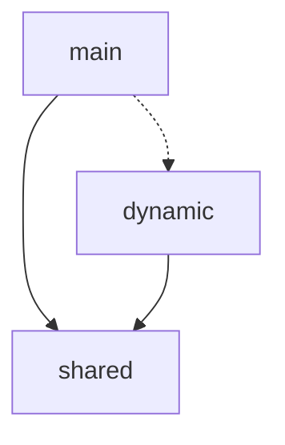
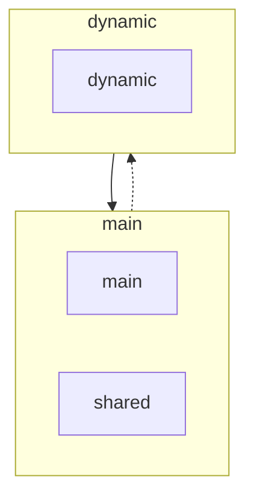
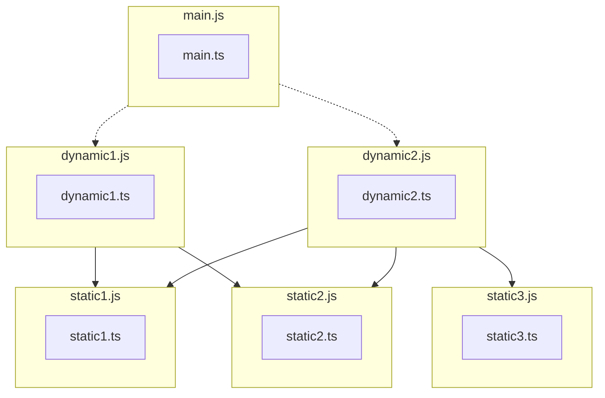
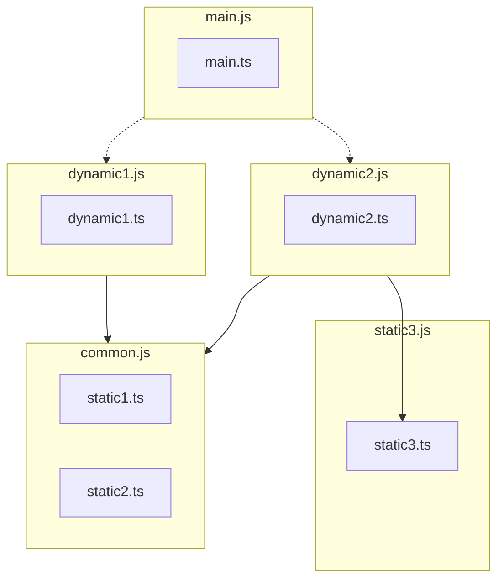
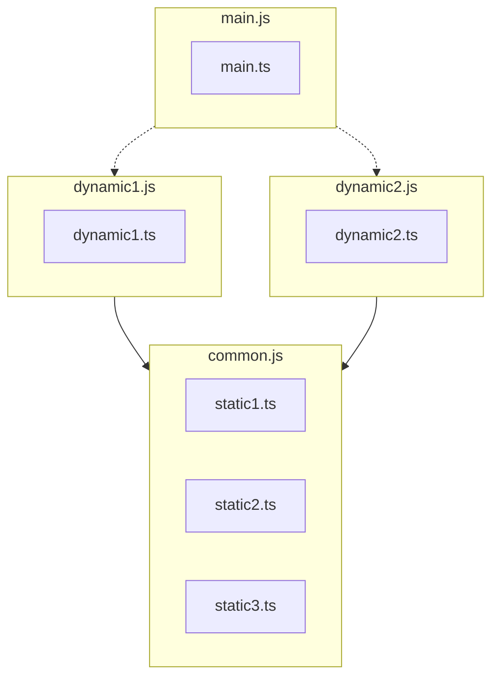

# NgxBuild

Tools to optimize build outputs from Angular when using Esbuild.

https://repl.rolldown.rs/#eNqNUsFugzAM/RUrF1qpgjsVu2y7Taq0TdqllwhMly01KDEdFeLf57SEtds0DRDBid97xn6DqlU+KCR2x/TNh29S+Ve8UqWEZt82jmHoR6hds4ckzSrNWhKSLZUN+cZiapvdol9uaUvn9EXIOpLemzIkLtdChipn1+G4Uq6xtmo+KBV4bXYpz9q/nFxVwccWYYDHKW3TspEKIJYW4ck6lIL9CVNhrTvLsBhAtwbGZf4DX9zAEBAADrlzFCKQy1DbcQ5JbEmyOu+3Dj26A96H/SezIy0o9DnU2nqckkQendkLVts8MgJ4dqbk+x7LLohvXIUuh9CZCTdOa9PxSX1GZpmuDppKrG5fO3oXufkoHBoqbVfhHbZIFVJp0D+KiPPmgPZ4JRHSo8wYFnnJs6Usg2fTCrN0KjVC00f+oihAf2jDECc8N1vmLrjzFXCXP/4HLrvMCyRKrDFZK/ohhmcTTAMNpmPooYDkZfMgdxj3tRPXJ67ZgDPd184/zP2dVI1CehCU1Yye1fgJOTMWYg==

https://esbuild.github.io/try/#YgAwLjI1LjExAHsKICBidW5kbGU6IHRydWUsCiAgZm9ybWF0OiAnZXNtJywKICBzcGxpdHRpbmc6IHRydWUsCiAgb3V0ZGlyOiAnLycsCn0AZQBlbnRyeS5qcwBpbXBvcnQge3h9IGZyb20gJy4vZGF0YS5qcycKY29uc29sZS5sb2coeCkKCmltcG9ydCgnLi9keW5hbWljLmpzJykAAGR5bmFtaWMuanMAaW1wb3J0IHt4fSBmcm9tICcuL2RhdGEuanMnCgpjb25zb2xlLmxvZyh4KQAAZGF0YS5qcwBleHBvcnQgY29uc3QgeCA9ICdXT0xPTE8nOw

## Motivation

The Esbuild chunking algorithm considers each dynamic entry point, as its own entry point. Because it does not
distinguish between entry points, it will optimize each entry point to reduce the amount of code required to load that
entry point.


TODO add visual

However, in the context of single page applications like angular, there is only one entry point and the rest of the
dynamic entry points cannot load or function outside that context. This means that we do not need to optimize for each
entry point but instead optimize for the entry points considering only there reachability from the main entry point.

TODO add visual


#### Transpiled Source

TODO refine this section

```ts
// main.ts
import('./dynamic1');
import('./dynamic2');

// dynamic1.ts
import './static1';
import './static2';
import './static3';

// dynamic2.ts
import './static1';
import './static2';
import './static3';
```

#### Transpiled Output



### Bundling with Angular and esbuild

TODO showcase angular behaviour

---

## State of the art

TODO explain reachability strategy

TODO Explain the feature

```ts
  /**
   * Registers the imported file into a map that will allow pointing the them externally
   * bundle-optimization-map.json
   * {
   *   "sports-root-route": {
   *    "inputFile": "sports.ts"
   *    "outputFile": "sports-XXXXXX.js"
   *   }
   * }
   * 
   * This will make it easier to reference imports post bundling by using a tag instead of seaching for them via the 
   * esbuild stats json with a mapped output path.
   * Additionally it can be used for preloading or getting the reference of the feature
   * There can only be one tag per output path
   */
  entryPointRef?: string; // Shortend to reference an entry point (used later on future optimizations) TODO explain reference them
```

### Reachability strategy

The reachability strategy attempts to optimize the bundle as much as possible without any significant increase in bundle size.

It does this by traversing the imports and merging chunks based on the paths from which the code is reachable.

### TODO Common Strategy

### TODO Stratic Closure Strategy

## Bundling using import attributes 

TODO description
TODO example of using all together (optional)

### chunkName attribute

Dynamic Imports marked with the chunkName attribute will generate a new named chunk. All imports of the market file will end up in this chunk. eg. <chunkName>-XYZ.js.

#### chunkName usage

TODO add standalone example

##### chunkName and include attribute

Imports marked with chunkName can have different strategies configured. If the include attribute is not used it default to withSharedDeps.

###### include withSharedDeps 

If withSharedDeps is used for includes, the generated chunk will include shared dependencies of dynamic imports marked
with the same chunkName.

```ts
// main.ts
import('./dynamic1', { "with": { "chunkName": "common" } });
import('./dynamic2', { "with": { "chunkName": "common" } });

// dynamic1.ts
import './static1';
import './static2';
import './static3';

// dynamic2.ts
import './static1';
import './static2';
import './static3';
```



##### include withAllDeps

If withAllDeps is used for includes, the generated chunk will include all dependencies of dynamic imports marked with 
the same chunkName.

```ts
// main.ts
import('./dynamic1', { "with": { "chunkName": "common" } });
import('./dynamic2', { "with": { "chunkName": "common",  "include": "withAllDeps" } });

// dynamic1.ts
import './static1';
import './static2';
import './static3';

// dynamic2.ts
import './static1';
import './static2';
import './static3';
```

#### Include withAllDeps Output



#### Include Types

```ts

export type IncudeStrategy = |
  // optimize bundling per view / route
  | 'withSharedDeps' // The static imports of the files which are the same as all the bundles with the same name
  | 'withAllDeps'; // The static imports of the files regardless of if they are shared by other bundle with the same name


interface ChunkNameAttribute {
  chunkName: string; // slug of the bundle this import and/or its deps should end up in
}

interface ChunkNameAttributeWithInclude extends ChunkNameAttribute {
  include: IncudeStrategy, // defaults to withSharedDeps
}

export type ChunkNameAttribureOptions = ChunkNameAttribute | ChunkNameAttributeWithInclude;
```

## Risk Management

### Rolldown considerations

This is achievable with rolldown and would usually be the default behaviour. However, there are a couple caviates and
configurations that would have to be used.

TODO explain the config and why its necessary

Yet, this still does not work when rebundling an angular application, because of that we require analyzing the module
graph ourselves and create an advance chunking strategy based on this strategy.

#### Bundlers

TODO baseline documentation on bundlers

#### Document bundle issues 
TODO
- Chunk size
- Single chunk
- bundling vs transpailing 
- bundling performance 
- typechecking

